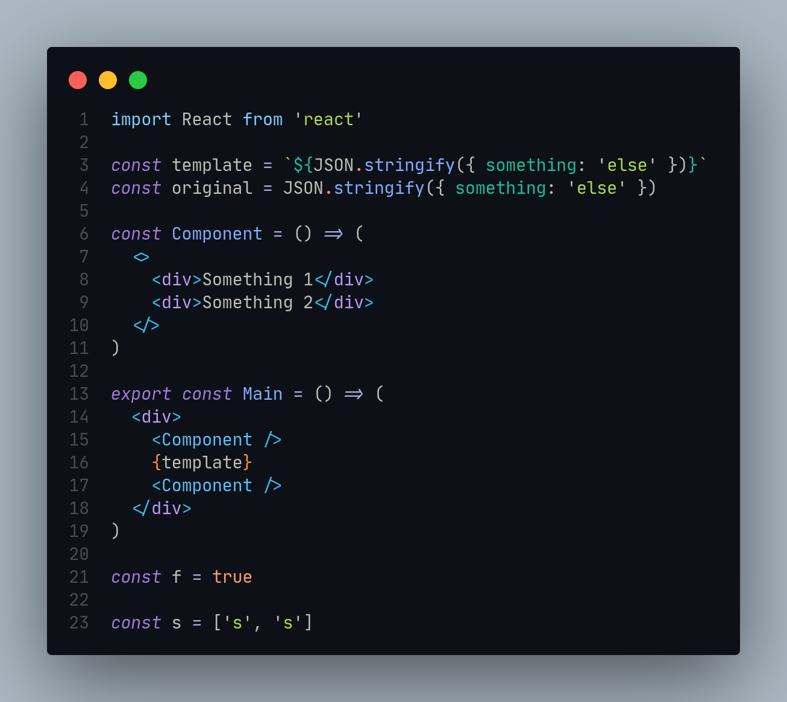
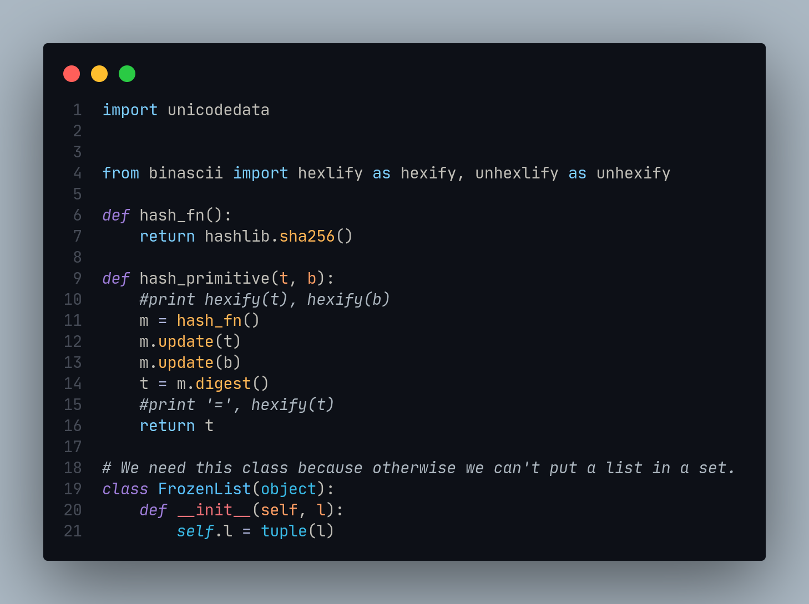

# AyuTokyo vscode Theme

## Description

Ayu Green Tokyo Night is a VSCode theme that mixes the best of both worlds: the vibrant colors of Ayu Green
and the dark, calming tones of Tokyo Night. The result is a theme that is both visually appealing and functional,
perfect for anyone who wants to add a touch of color to their coding experience.

### Features:

Vibrant colors that are easy on the eyes
Dark, calming tones that help you focus
A wide range of customization options to match your preferences
Benefits:

Increased productivity
Improved focus
Reduced eye strain
Increased enjoyment of coding
Try it today and see the difference!

## Images

### javascript / tsx

### Python

## Ressources

- [ayu-green](https://marketplace.visualstudio.com/items?itemName=Siris01.ayu-green)

- [Tokyo-night-ported-nvim](https://marketplace.visualstudio.com/items?itemName=Dionannd.tokyo-night-ported-nvim)

- [JetBrainsMono Nerd Font](https://www.nerdfonts.com/font-downloads)
